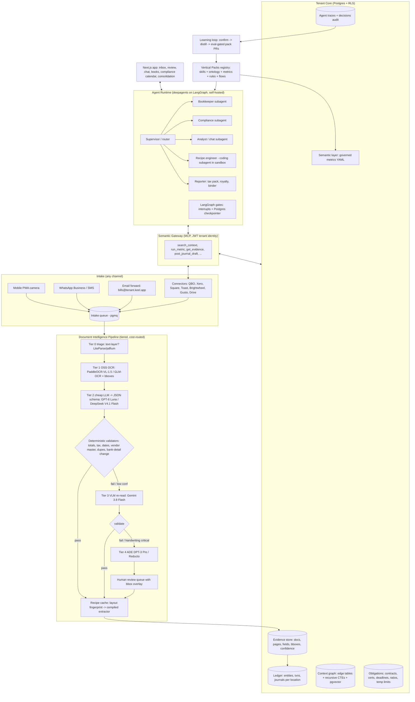
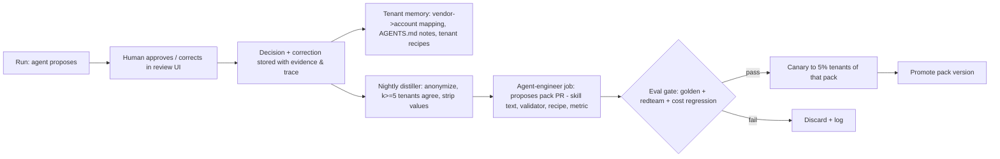

# Back-office AI for small businesses: start-up proposal

**Working name:** *Keel*, the back-office "operating system" for small businesses.
**First verticals:** ice-cream franchisees and children's day-care centres.
**Date:** 3 October 2026. **Status:** research-backed proposal (v1).

> **What Keel is.** Glean is a search engine over a company's knowledge. Keel is different: it is a *bookkeeper, compliance officer and operations clerk* for businesses with 1–50 staff.
>
> Keel is built as a coding agent that uses skills. It:
> - reads every document a business has, including handwritten ones;
> - links each number back to its source, down to the pixel on the page;
> - writes deterministic code ("recipes") the first time it sees a new kind of document, then re-runs that code at near-zero cost.
>
> The verticals are delivered as **Vertical Packs**: skills, ontology, metrics, compliance rules and connectors bundled for a business type. The first customers come through franchisors and accountants, not one at a time.

---

## 0. Summary for the impatient VP

| Question | Answer |
|---|---|
| **Problem** | SMB owners spend 5–15 hours a week on paper: supplier invoices (some handwritten), timesheets, temperature logs, attendance, subsidy claims, royalty reports, VAT/sales tax, and year-end books. Today's tools are either generic (ChatGPT, Claude, QuickBooks AI) or one-dimensional (Dext captures receipts; Brightwheel runs the centre but has little AI). |
| **Wedge** | "Paper in, books + compliance out." The owner drops in any document, by phone photo, email forward or WhatsApp. Keel extracts it, checks it, links it and posts it, and keeps an inspection- or audit-ready record. |
| **Why us, why now** | Three things became cheap in 2026: <br>• Open-weight frontier models: GLM-5.3, Kimi K3, DeepSeek V4. <br>• Small OCR models that beat frontier models on document benchmarks: PaddleOCR-VL-1.5, GLM-OCR, MinerU2.5. <br>• Agent harnesses with skills: deepagents 0.7. <br>The architecture comes from two of your repos: the "agents propose, code decides, humans approve" pattern from `recon_knowledge_work_agent_v2` and the governed semantic layer from `edm_sementic_layer_v3.0`. |
| **Differentiators** | 1. Every figure is traceable to the exact pixels it came from. <br>2. Compile-once recipes, so cost per document falls over time. <br>3. Hierarchical multi-tenancy (franchisor → franchisee → location; accounting firm → clients). <br>4. Vertical compliance packs. <br>5. Governed cross-tenant learning that gets better with every customer. <br>6. Open Agent-Skills packs that also run *inside* Claude and ChatGPT. Their distribution becomes ours. |
| **Cost target** | ≤ **$12 per location per month** in AI and infrastructure cost (estimate), against a price of **$99–249 per location per month**. That is a gross margin above 90%. |
| **Stack** | deepagents 0.7 on self-hosted LangGraph with Postgres checkpointing; FastAPI; Next.js. Postgres provides tenant isolation (row-level security), vector search (pgvector), BM25 keyword search (pg_textsearch) and the context graph (typed edge tables and recursive CTEs), so there is no separate graph database. Everything runs on Cloud SQL (see the [technical deep-dive](TECH_DEEP_DIVE.md)). Model access goes through OpenRouter with our own keys, routed by tier. |
| **First 90 days** | MVP for one vertical (day care: UK + US). Then one franchisor pilot (ice cream). Then the accountant channel. |

---

## 1. What exists today, and the gap

### 1.1 Anthropic: `knowledge-work-plugins/small-business` (v1.35.1, 15 Sep 2026)

This plugin is the best public reference for SMB agent skills, and we should learn from it rather than compete with it.

**What it contains**
- **44 skills, about 6.4k lines of markdown, no code.** Grouped as:
  - **Finance:** `ap-processor`, `month-end-prep`, `close-month`, `payroll-prep`, `tax-season-organizer`, `cash-flow-snapshot`, `invoice-chase`, …
  - **Sales and marketing:** `lead-triage`, `review-reputation`, …
  - **Operations and HR:** `inventory-planner`, `hiring-screener`, `contract-review`, …
  - **Setup:** `smb-onboard`, `smb-router`, `build-agent`, `build-connector`.
- **35 HTTP connectors (MCP servers)**, including QuickBooks, Xero, Gusto, Square, Stripe, PayPal, Shopify, Zoho, DocuSign and Zapier.

**Design ideas worth copying directly**
- **Two approvals for money.** Coding a bill and paying it are separate steps, each needing approval. Eleven skills are "chains" (they link other skills), and every handoff between steps is approved.
- **No invented numbers.** An unreadable field is left empty and named as unread (`shared/absent-is-not-zero.md`).
- **`shared/untrusted-content.md`.** Defends against prompt injection and fraud that changes bank details on a bill.
- **`shared/tenant-scope.md`.** A connected mailbox or Drive is not assumed to belong to the business.
- **"Test the capability, not the logo."** Check what a connector can actually do. If writing isn't possible, fall back to producing an import file.
- **Progressive disclosure.** A short `SKILL.md`, with `reference/*.md` files loaded only when needed.

**What it does not do. This is our opening.**

| Gap | Evidence in the repo |
|---|---|
| **Not multi-tenant.** It runs for one owner in one desktop session, and business context is stored in Cowork session memory. | `smb-onboard` writes a `## Business context` block into memory. There is no support for an accountant or franchisor managing many businesses, and no audit trail. |
| **No document pipeline.** Handwriting is read by the model's own vision, plus a rule to flag low confidence. | There is no OCR tiering, no confidence score per field, no review queue and no link back to the source pixels. |
| **No vertical compliance.** | A search for ratio, HACCP, food-safety or OSHA finds nothing. There is no shift rostering, and tax is US federal only. |
| **Desktop and per-seat.** | It needs a Claude Pro/Max/Team seat, and runs in the Cowork desktop app rather than as a hosted automation that runs headless. |
| **No accounting connector in `finance/`.** | `finance/CONNECTORS.md` says: "no supported MCP servers yet" for ERP/accounting. |

**Market signal.** "Claude for Small Business" launched on 13 May 2026, expanded in September, and has more than 900k installs (Forbes, 15 Sep 2026). Demand is clearly real. Anthropic is supplying the *horizontal* layer, and nobody owns the *vertical, multi-tenant, compliance-grade* layer.

### 1.2 Others moving into SMB agents

| Player | What they ship | Threat | Our angle |
|---|---|---|---|
| **Intuit** (QuickBooks agents, "Intuit Intelligence") | Accounting, payments, finance and project agents, bundled from $38 to $275 a month | High for generic bookkeeping | We integrate with QuickBooks as the ledger of record. We own the documents, compliance and multi-location layer, which Intuit does not. |
| **Xero JAX** (July 2026) | Document capture into the ledger, automatic bank reconciliation, chasing clients for documents. Connects to Claude and ChatGPT. | High in the UK | Same response. Xero is the ledger; we are the vertical pack and the evidence store. |
| **OpenAI** | Workspace Agents (successor to custom GPTs), a ChatGPT small-business programme, and AgentKit. Reports say Agent Builder is being wound down (unverified). | Medium | Horizontal; no vertical depth. We publish our packs into ChatGPT as an app. |
| **Glean** | Search plus agents. About $45–65 per user per month with a 50–100 seat minimum (third-party estimate). | Low | Out of reach for SMBs on price. |
| **Docyt** ($299–999 per location per month) | AI bookkeeping for franchises and multi-location businesses | **Closest competitor** for ice cream | No compliance or operations; finance only. |
| **MarginEdge / Restaurant365** (about $330–540 per location) | Restaurant invoices, food cost, accounting | Medium | Expensive and restaurant-specific. |
| **Dext / Hubdoc** ($12–30 a month) | Receipt and invoice capture | Low to medium | Capture only. No agent, no compliance, no chat. |
| **Brightwheel / Procare / Kangarootime / Lillio** | Childcare management. AI is thin (Procare's RoomRunner is the main example). | Partner, not threat | They are the systems of record for children and attendance. We connect to them and add finance, compliance and document intelligence. |
| **Jolt / 7shifts / Toast IQ / FranConnect** | HACCP logs, scheduling, POS AI, royalty management | Partners | Integrate with them. FranConnect is the route to franchisors. |

**Takeaway.** Generic "chat with my QuickBooks" will be free or bundled within 12 months. We must win on **vertical depth, evidence and trust, multi-entity structure, and cost**, not on the chat interface.

---

## 2. The customers and the jobs they need done

### 2.1 Persona A: day-care owner ("Priya"), one centre, 60 children, 14 staff (UK or US)

| Job | Today | With Keel |
|---|---|---|
| Supplier invoices and receipts (food, nappies, cleaning, repairs), some handwritten | Shoebox, then spreadsheet, then the accountant at year end | Photo or forward → extracted and validated → coded to the ledger, with a link to the source pixels |
| Parent invoicing; subsidy and funded-hours claims (US: CCAP/CCDF, rules now vary by state after the 2026 HHS rollback; UK: local-authority funded hours) | Manual reconciliation of co-pays against subsidy payments | A claims agent reconciles attendance → claim → remittance, and flags under-payments |
| **Staff-to-child ratios** (UK EYFS: e.g. 1:5 for 2-year-olds; paediatric first aid needed to count in ratio. US: set by each state, e.g. about 1:4 for infants) | A whiteboard roster | A rota agent checks ratios and qualifications per room per hour, and warns before a breach |
| **Staff certifications**: first aid, DBS (UK) or background checks (US, re-checked at least every 5 years), training hours | A paper file and memory | A certificate vault with an expiry calendar and automatic reminders |
| **CACFP meal records** (US): menus, meal counts at point of service, eligibility forms | Paper, audited | Photo of the meal-count sheet → structured record → monthly claim pack |
| **Inspection readiness** (Ofsted, which uses a renewed framework from Nov 2025; US state licensing) | A panic binder before each visit | An "inspection binder" skill that builds the evidence pack on demand |
| Year-end books, VAT / MTD, payroll prep | The accountant, at £1–3k a year | Books kept continuously; tax pack prepared and handed to the accountant or owner to file |

### 2.2 Persona B: ice-cream franchisee ("Marco"), three locations, seasonal staff of 8–25

| Job | With Keel |
|---|---|
| Dairy and supplier invoices, delivery notes, credit notes (often marked up by hand) | A three-way match (purchase order ↔ delivery note ↔ invoice); handwritten shortages detected and turned into credit-note requests |
| **Royalty and ad-fund reporting** (e.g. Baskin-Robbins: 5.9% royalty plus 5% ad fund on gross sales) | POS sales (Toast/Square) → royalty statement → franchisor portal; mismatches explained |
| Handwritten customer order pads (wholesale and catering orders) | Photo → order lines, normalised to the product catalogue, with handwriting rules (grouped pricing, strike-throughs, circled totals) → invoice draft or a QuickBooks import file |
| Production batch sheets and QC records (for owners who make product in-house) | Scanned forms → batch lot linked to ingredient lots, QC checks and packing; blank critical readings flagged as missing |
| **HACCP temperature logs** (freezer and dipping cabinet; UK "Safer Food Better Business" diary) | Photo of the paper log or a sensor feed → an alert when out of range → a compliance record that holds up in an audit |
| Seasonal hiring and onboarding (US I-9; UK right-to-work checks), shift scheduling, payroll prep | Onboarding checklist agent; rota agent; payroll prep handed to Gusto or Xero Payroll |
| **Multi-location consolidation** | Books per location, then a consolidated P&L, then a franchisor KPI pack |
| Sales tax (US prepared-food rules differ by state) or UK VAT (ice cream is standard-rated at 20%) | Tax treatment driven by rules in the vertical pack, with an evidence trail |

### 2.3 What the two personas share (this is the platform)

Despite the different businesses, the jobs reduce to the same building blocks:

```
Documents → Fields with evidence → Entities (vendor, customer/family, staff, location, child, product)
         → Transactions / Journal entries → Ledgers per entity → Consolidation
         → Obligations (contracts, certifications, deadlines, ratios, temperature limits)
         → Reports (P&L, VAT/MTD, 1099, royalty, CACFP, inspection binder)
```

About 80% of the work is shared. The other ~20% is **Vertical Pack** content: skills, ontology terms, metrics, rules and connectors.

---

## 3. Product principles

1. **Paper first, mobile first.** Owners photograph things, so the main way in is a phone photo, WhatsApp or an email forward, not a desktop upload screen.
2. **Agents propose, code decides, humans approve** (from `recon_knowledge_work_agent_v2`).
   - An LLM never computes a total, a tax figure or a ratio. Deterministic code does.
   - Anything touching money, a filing or a customer has an approval gate.
3. **Evidence or it didn't happen.**
   - Every number carries provenance: document, page, bounding box, extractor, confidence, and who approved it.
   - Absent is not zero.
4. **Compile once, replay forever.**
   - The first time Keel meets a new supplier's invoice layout, or a new POS export, a coding agent writes a recipe.
   - After that, the recipe runs with no LLM calls.
5. **Tenant isolation is a database property, not a convention.** It is enforced by Postgres row-level security (RLS) together with tenant identity carried in the JWT.
6. **Prepare, don't file.**
   - Keel prepares tax figures and returns. The owner or a partner accountant reviews and submits.
   - This avoids the US preparer (PTIN) and Circular 230 issues, and the UK tax-adviser registration with HMRC required from 18 May 2026.
7. **Cheapest model that passes the eval.** Model choice is a routing decision checked against golden datasets, not a brand loyalty.

---

## 4. Architecture

### 4.1 System overview



### 4.2 Multi-tenancy model (hierarchical)

```
Platform
 └─ Organization (billing + identity root)
     ├─ type: franchisor | accounting_firm | independent
     └─ Business (legal entity: own ledger, tax IDs)
         └─ Location (site: own rota, temp logs, ratios, POS)
```

**Who can see what**
- A **franchisor** can see the *metrics* it is entitled to from each franchisee (gross sales, royalty, compliance status), as set by policy. It cannot see their books.
- An **accounting firm** can see the full books of the clients that granted it access, using delegation tokens that can be revoked.
- **Consolidation** works upwards: Location → Business → (optionally) Organization group.

**How isolation is enforced (defence in depth)**

The Prism repo already does this; we add a tenant dimension.

| Layer | What enforces the tenant boundary |
|---|---|
| Postgres | `tenant_id` on every row; RLS policies tied to `current_setting('app.tenant_id')`, set per transaction from the JWT. |
| Gateway | Tenant identity comes **only** from the JWT, never from tool arguments. Results are returned as handles scoped to the user and tenant, not as raw rows. |
| Agent filesystem | Each tenant gets its own `CompositeBackend` routes (`/skills/` read-only, `/notes/` for tenant `AGENTS.md`, `/work/` for per-run scratch). A wildcard tenant is rejected (`sponsor_id <> '*'` in recon v2 becomes `tenant_id`). |
| LangGraph | The store namespace is prefixed with `(org, business)`. Threads are owned by the tenant. |
| Sandbox | One ephemeral sandbox per run, with no network and a read-only upload mount (from recon v2's `docker_backend.py`). In production, use Modal, Daytona or E2B so it scales to zero. |
| Encryption | Each tenant gets its own data key, wrapped by KMS, for the document blob store. |

### 4.3 Agent design (deepagents)

The shape is the one already proven in `recon_knowledge_work_agent_v2` (`assembly.py` with a supervisor and a `CompiledSubAgent` recipe engineer) and in LangChain's `paid-media-agent`. The parts:

- **One assembly, three runtimes:** API (FastAPI + SSE), worker (queue consumer), CLI/tests. They all share `build_agent_components(tenant, pack, mode)`.
- **Supervisor (router).**
  - It loads the business's installed Vertical Packs and only the front matter of their skills.
  - It has modes such as `chat`, `process_inbox`, `close_month`, `prepare_report` and `inspection`. Each mode gets a different tool surface through `InvocationGuardMiddleware` / `ToolSurfacePolicy`.
- **Subagents:**
  - **Bookkeeper.** Codes bills, matches documents, proposes journal entries and reconciles against bank and POS.
  - **Compliance officer.** Checks ratios, certificate expiries, HACCP ranges and contract obligations; maintains the compliance calendar.
  - **Analyst.** Chat over the semantic layer. It uses `search_context` then `run_metric` and never writes free SQL against the ledger. This follows Prism's gateway.
  - **Recipe engineer (coding agent).** Runs in the sandbox. It writes `recipe.py` for a new document layout or connector export, and loops on `recipes check` against golden files, up to N attempts. The output is versioned per tenant **and** can be promoted to a pack-level recipe (§6).
  - **Reporter.** Builds tax packs (VAT/MTD, Schedule C, 1099 list at the $2,000 threshold from 2026), royalty statements, CACFP claims and inspection binders. Its output is files (XLSX/PDF) plus an evidence appendix.
- **Gates are LangGraph nodes, not prompts.** The run follows a fixed spine: `intake → extract → validate → gate_review → post_draft → gate_approve → sync_to_ledger → finalize`. It pauses with `interrupt()` and checkpoints to Postgres. Approvals are written to an append-only `decisions` table.
- **Middleware**, reused from recon v2 and paid-media: `OffloadMiddleware` (large tool results go to files), `RedactionMiddleware` (secrets and PII), retry and call limits, `current_date`, and a new **`BudgetMiddleware`** that enforces a per-tenant monthly AI-spend ceiling and drops to cheaper model tiers as it nears the cap.
- **Untrusted-content guard.** Document text is data and never instructions (from Anthropic's `untrusted-content.md`). A change to a supplier's bank details always triggers a hard approval.

### 4.4 Document intelligence pipeline: the cost engine

| Tier | When | Engine | ≈ cost per page |
|---|---|---|---|
| 0 | Born-digital PDFs and e-invoices (most supplier invoices) | LiteParse (Apache-2.0) / pdfium text layer, plus layout | ~$0 |
| 1 | Scans and photos | **PaddleOCR-VL-1.5** (Apache-2.0, OmniDocBench v1.5 94.5) or **GLM-OCR** (MIT, 0.9B; API ≈ $0.10 per 1k pages). Both return bounding boxes. | $0.0001–0.0005 |
| 2 | OCR text → typed JSON (`Invoice`, `DeliveryNote`, `Timesheet`, `TempLog`, `MealCount`, …) | **GPT-6 Luna** ($0.10/$0.50 per M tokens), or **DeepSeek V4.1 Flash** off-peak ($0.15/$0.60) | $0.0003–0.001 |
| 3 | A validator fails, a field's confidence is low, or handwriting is detected | **Gemini 3.8 Flash** with the page image (Batch/Flex is half price; the price **doubles on 1 Jan 2027**, so budget for $1.50/$7.50) | $0.002–0.006 |
| 4 | Still failing, or a critical handwritten field (amount, date, signature) | **LandingAI ADE Gen2, DPT-3 Pro** (handwriting, line-level grounding; about 2–3¢ priority, about half on the standard async tier), or **Reducto** Extract (2¢) | $0.01–0.03 |
| H | Still uncertain | Human review queue: a side-by-side bounding-box viewer with one-tap fixes. **Every fix becomes training signal** (§6). | Owner's time |

**Blended estimate:** **$1.5–3 per 1,000 pages**, assuming 70% stop at tiers 0–2, 25% at tier 3 and 5% at tier 4. Sending every page to a premium API would cost $6–40 per 1,000.
**After recipes compile**, a returning supplier layout skips tier 2: the recipe maps OCR boxes to fields deterministically. The marginal cost of an extraction then approaches the OCR cost alone.

**Deterministic validators** form a library shared by all packs, each with its own error code. Every invoice gets these checks:
- line items × quantity add up to the subtotal, and subtotal + tax = total;
- the tax rate is valid for the jurisdiction and item class (for example, UK ice cream at 20% VAT);
- dates are plausible and the payment terms are consistent;
- the vendor matches the vendor master (fuzzy matching, as in `attribute_mapper`);
- duplicates are detected (vendor + number + amount, plus a perceptual hash of the image);
- bank details have not changed since the last invoice from that supplier.

**Handwriting reality check.** 2026 benchmarks (WildHandBench, OmniHandwritingOCR) show every system still "hallucinating plausible corrections" on handwriting. Three rules follow:
- handwritten *amounts* never post without either matching another source (POS, bank, PO) or a human tap;
- we build an **internal gold set** of 300–500 real pages per vertical from day one;
- we route by measured accuracy on that gold set, not by vendor claims.

Also assume most small-business scans have **no text layer**: phone photos and photocopied forms go straight to tier 1 OCR. Validators need handwriting-specific rules for grouped prices, crossed-out lines, circled totals and tick marks.

### 4.5 Semantic layer and context graph: the per-tenant "business brain"

This part is adapted from `edm_sementic_layer_v3.0` (Prism). The big change is that the graph lives in **plain Postgres instead of Neo4j**. It is stored as typed tables plus a generic `edges(tenant_id, src, rel, dst, valid_from, valid_to, provenance)` table, with recursive CTEs for 1–4 hop traversals and pgvector next to it. Apache AGE was dropped because it is not offered on Cloud SQL or AlloyDB. The result is one managed database, native row-level security, and low cost. Graph access sits behind a repository interface (`neighbors`, `trace_lot`, `find_paths`), so a Neo4j or Spanner Graph projection can be added later without rewriting agents. See the [technical deep-dive §5](TECH_DEEP_DIVE.md).

**Ontology (core plus pack extensions)**

| Scope | Concepts |
|---|---|
| Core | `Business`, `Location`, `Vendor`, `Customer`, `Staff`, `Document`, `Field`, `Transaction`, `JournalEntry`, `Account`, `Contract`, `Obligation`, `Deadline`, `Report` |
| Day-care pack | `Child`, `Guardian`, `Room`, `Session`, `Attendance`, `RatioRule`, `Certification`, `SubsidyClaim`, `MealCount`, `Inspection` |
| Ice-cream pack | `Product`, `Recipe(BOM)`, `Delivery`, `TempReading`, `HACCPLimit`, `RoyaltyAgreement`, `AdFund`, `POSDailySales` |

**Graph edges** link the evidence, for example:

```
(Invoice)-[:BILLED_BY]->(Vendor)
(Invoice)-[:FULFILS]->(PO)
(DeliveryNote)-[:DELIVERED_AGAINST]->(PO)
(Field)-[:EXTRACTED_FROM {bbox}]->(Page)
(Contract)-[:IMPOSES]->(Obligation)-[:DUE_ON]->(Deadline)
(Staff)-[:HOLDS]->(Certification)
(Shift)-[:STAFFS]->(Room)
```

This is what "link data between different invoices" means in practice: price-drift alerts per supplier and SKU, missing credit notes, contract price compared with billed price, and so on.

**Governed metrics** are YAML files in the pack, for example `food_cost_pct`, `royalty_due`, `ratio_compliance_rate`, `occupancy`, `revenue_per_child`, `labour_pct`. The analyst agent calls `run_metric` and never hand-writes SQL. The same metric definitions drive the dashboards, the chat answers and the reports, so the numbers always agree.

**Hybrid retrieval** combines vector search, BM25 (keyword ranking) and graph expansion. It returns a context pack of about 3k tokens, the same pattern as Prism's `retrieval.py` and its `gate()` filter.

**Agent trace memory** stores `(:Trace)-[:HAS_STEP]->(:ToolCall)-[:TOUCHED]->(:Ctx)` for every run, owned by the tenant and kept for a set period. Traces power three things: explaining any answer ("why is this coded to Repairs?"), debugging, and the learning loop.

### 4.6 Connectors

Connectors use MCP first, with a deterministic fallback.

| Group | Connectors |
|---|---|
| Ledgers (systems of record; we write drafts, they hold the books) | QuickBooks Online, Xero (both have official MCP endpoints, already used by Anthropic's plugin), plus FreeAgent and Sage for the UK later |
| POS | Square, Toast, Clover, Lightspeed |
| Payroll | Gusto, Xero Payroll, QuickBooks Payroll |
| Childcare | Brightwheel, Procare, Kangarootime, Famly (UK), Blossom (UK). Many lack public APIs, so at first we use **CSV/export recipes** written by the recipe engineer. |
| Food safety | Jolt (sensors and checklists), or paper logs by photo |
| Franchisor | FranConnect Royalty Manager (export/import) |
| Comms / files | Gmail and M365 (forward-to-inbox), Google Drive / OneDrive, WhatsApp Business Cloud API |
| Tax | HMRC MTD VAT and ITSA APIs (later, via recognised-software status or a partner); US: produce files for the accountant |

Following Anthropic's "test the capability, not the logo": if a connector cannot write, Keel produces an import file (QBO/Xero CSV) instead.

---

## 5. Vertical Packs: how Keel generalises to any SMB

A pack is the unit of extensibility. It is a versioned folder, and it follows the **Agent Skills open standard** (`SKILL.md` with frontmatter, progressive disclosure), so it is portable.

```
packs/
  core-bookkeeping/           # shared by every vertical
    pack.yaml                 # id, version, depends_on, jurisdictions, connectors, pricing tier
    skills/
      ap-intake/SKILL.md      # + reference/{validators.md, gotchas.md}
      bank-reconcile/SKILL.md
      month-end-close/SKILL.md
      consolidate/SKILL.md
      tax-pack-uk-vat-mtd/SKILL.md
      tax-pack-us-schedule-c/SKILL.md
    ontology/core.v1.yaml
    metrics/*.yaml
    rules/*.py                # deterministic rules (pure functions, unit-tested)
    flows/*.flow.yaml         # LangGraph spine + UI stepper as data (recon v2 pattern)
    recipes/                  # promoted, layout-fingerprinted extractors
    evals/golden/*.json       # gold docs + expected outputs; redteam.yaml
  childcare-uk/               # depends_on: core-bookkeeping
    skills/{ratio-check, staff-certs, funded-hours-claim, ofsted-binder, parent-billing}/
    rules/eyfs_ratios.py      # versioned per regulation effective date
  childcare-us/
    skills/{ratio-check, ccap-claim, cacfp-claims, licensing-binder}/
    rules/state_ratios/{ca,tx,ny,...}.yaml
  franchise-qsr/
    skills/{royalty-report, haccp-log, three-way-match, food-cost, seasonal-onboarding}/
```

**How a pack is built and maintained**

- **Author once, run anywhere.**
  - The same skills run inside Keel, where they gain multi-tenancy, evidence, recipes and gates.
  - They can also be exported as a **Claude Cowork plugin or ChatGPT app**, a thin version backed by Keel's MCP gateway.
  - This turns the 900k-install Claude SMB ecosystem into a top-of-funnel for Keel.
- **New vertical = new pack.** Examples: dental practice, cleaning company, landscaper, salon.
  - About 70–80% is inherited from `core-bookkeeping`.
  - Building one means: a skill-authoring session with Claude Code / deepagents, a gold set of 200 documents, and an eval run.
  - Target: **under 3 weeks per new vertical.**
- **Regulation as versioned data.** Ratio tables, VAT rates and 1099 thresholds are YAML with an `effective_from` date and a citation, never words inside a prompt.

---

## 6. Learning loop: governed self-improvement

This is RSI kept deliberately safe, with every step gated. It extends Prism's confirm-and-distill flywheel and LangChain's practice of appending to `agents.md` and consolidating weekly.



**Three levels of memory**

1. **Tenant memory** works instantly and needs no model calls:
   - vendor → account mappings;
   - the supplier's usual VAT treatment;
   - "Marco always buys from Dairy X on Tuesdays";
   - tenant-specific recipes.
2. **Pack memory** works across tenants, with privacy safeguards:
   - It learns only *structure*: layouts, field positions, coding rules, validator thresholds. It never learns values.
   - It needs at least k distinct tenants to agree, following Prism's "≥2 distinct callers" anti-poisoning rule, raised to ≥5 tenants.
   - Results are promoted to the pack.
   - **This is a network effect.** The 50th franchisee of a brand gets near-perfect extraction for that brand's suppliers on day one.
3. **Platform memory** is model-routing data:
   - It records, for each (document type, field, tier), the measured accuracy and cost.
   - The router updates its thresholds weekly. This is cost-RSI.

**Safety:**
- the system never changes its own gates or validators without human code review;
- every promotion is versioned and can be rolled back;
- evals are deterministic (Prism style: graded against numbers, with no LLM judge for financial outputs).

---

## 7. Models: cheapest option that passes the eval

**Name checks** (as of 3 Oct 2026; please re-check prices on vendor pages, because most figures came from aggregators):

| You said | Reality |
|---|---|
| GLM 5.3 | ✅ **GLM-5.3** (Z.ai), 14 Aug 2026. About 750B mixture-of-experts with ~40B active, 1M context. #1 open-weights model on the Artificial Analysis index. API about $1.40/$4.40 per M tokens. |
| Kimi K3 | ✅ **Kimi K3** (Moonshot), 16 Jul 2026. 2.8T total / 104B active, open weights. **Not cheap: $3/$15.** Use it sparingly. |
| Gemini 3.8 Flash | ✅ Released 2 Sep 2026. $0.75/$3.75 at an **introductory price that doubles on 1 Jan 2027** (unverified). There is no 3.8 Flash-Lite text model; the cheapest text model is 3.5 Flash-Lite. |
| GPT 6.1 Luna | ❌ Does not exist. You probably mean **GPT-6 Luna** ($0.10/$0.50, 1M context, 22 Sep 2026). GPT-6.1 shipped only as *Sol* ($2/$10). |

**Routing table (starting point; the eval harness decides the final choice)**

| Role | Primary | Fallback | Why |
|---|---|---|---|
| Classification, extraction → JSON, summaries, notifications | GPT-6 Luna | DeepSeek V4.1 Flash (off-peak batch), Qwen3.5 Flash | High volume, schema-constrained, cheap |
| Supervisor, tool-calling chat, bookkeeping reasoning | GLM-5.3 (or GLM-5.2 on DeepInfra at about $0.75/$2.40) | Gemini 3.8 Flash, DeepSeek V4 Pro off-peak | Strong tool calling (GLM-5.2 scores 99.1 on τ²-bench); open weights allow self-hosting later |
| Page parsing (printed scans) | GPT-6 Luna, `reasoning.effort=none`, Batch | Gemini 3.8 Flash (thinking LOW, media_resolution MEDIUM) | Luna is about 7–14× cheaper per page; Gemini's price doubles on 1 Jan 2027 |
| Vision re-read, handwriting | Gemini 3.8 Flash (thinking LOW) or ADE DPT-3 Pro | Qwen3-VL-8B self-hosted; Gemini 3.1 Pro for the hardest fields | Decided per field by measured gold-set accuracy |
| Recipe engineer (coding), contract review, tax-pack review | Kimi K3 or GPT-6.1 Sol | Claude (when the budget allows) | Runs rarely and its cost is spread across every later run; quality matters most here |

**Cost levers**
- Route through **OpenRouter with our own keys** (no fee up to $25k a month), so switching models is a configuration change.
- Prompt caching: cached input is 90%+ cheaper. Keep skill front matter and system prompts stable.
- Batch and off-peak processing for the inbox. Owners don't need sub-second processing of a delivery note.
- Recipes remove the LLM from repeat work.
- `BudgetMiddleware` enforces a ceiling per tenant.
- Measured, not assumed: every LLM call is logged with tenant, tier, tokens and cost.

### 7.1 Unit economics per location per month (estimate)

Assumes about 800 pages a month, 60 chat turns, and one month-end close.

| Item | Est. cost |
|---|---|
| Document pipeline (800 pages × about $0.003) | $2.40 |
| Agent and chat tokens (about 20M input, 80% cached, + 1M output on Luna/GLM mix) | $2–4 |
| Escalations (Gemini 3.8 Flash at 2027 prices, ADE) | $1–3 |
| Infrastructure share (Postgres, object storage, workers, sandbox minutes) | $2–3 |
| **Total** | **≈ $7–12** |
| **Price** | Starter $49 (≤150 docs) · **Pro $149 per location** · Multi-site / franchise $99 per location (from 10 units) · Accountant firm $29 per client, white-label |
| **Gross margin** | **~90%** |

---

## 8. Tech stack: lean on purpose

| Layer | Choice | Rationale |
|---|---|---|
| Agent harness | **deepagents 0.7.x** (skills, subagents, `CompositeBackend`, `FilesystemPermission`, sandboxes) | Matches the paid-media agent and recon v2; skills follow the open standard |
| Orchestration | **LangGraph 1.2, self-hosted** inside FastAPI, with `langgraph-checkpoint-postgres` | Avoids LangSmith Deployment per-minute uptime fees while we are early; Managed Deep Agents is US-only beta |
| Observability | OpenTelemetry → self-hosted **Langfuse** (or the LangSmith free/Plus tier) | Cost and traces per tenant |
| Database | **Postgres 17 on Cloud SQL** (Docker locally): RLS, pgvector (halfvec), pg_textsearch BM25, edge tables for the graph, a queue table | One managed database handles OLTP, vectors, keyword search, the graph and the queue |
| Blob storage | Cloudflare R2 (no egress fees) with per-tenant prefixes and keys | Cheap |
| Sandbox | Modal or E2B (scale to zero); Docker + gVisor for self-hosting | Recipe engineer only |
| OCR serving | Locally: GLM-OCR or PaddleOCR-VL via Ollama or MLX. On GCP: Cloud Run **jobs** on an L4 GPU (scale to zero, about $1.05/hr) for nightly batches, and CPU Cloud Run for Tesseract/PP-OCRv5 triage | Low SMB volume means we must not pay for an idle GPU; use APIs until volume justifies GPUs |
| Frontend | **Next.js 15 + React**, `assistant-ui` / LangGraph `useStream`, PDF.js bounding-box overlay viewer, shadcn/ui; installable PWA for the camera | |
| Auth / tenancy | Clerk or WorkOS (organisations, invitations, SSO later) → JWT claims `org_id, business_id, location_ids, role` | |
| Messaging | WhatsApp Business Cloud API, Postmark inbound email | Paper-first intake |
| Infrastructure | Local: docker-compose. GCP: Cloud Run (API, workers, jobs) + Cloud SQL + GCS + Secret Manager, with Terraform | Low fixed cost; one cloud |

**What to reuse from your repos**

| From | Take |
|---|---|
| `recon_knowledge_work_agent_v2` | The `assembly.py` pattern, supervisor plus `recipe_engineer` `CompiledSubAgent`, `InvocationGuardMiddleware` / `ToolSurfacePolicy`, `OffloadMiddleware`, `RedactionMiddleware`, sandbox interface, gate spine with `PostgresSaver`, append-only `run_decisions`, versioned `recipes` table keyed by layout fingerprint, flow-YAML-driven UI, scripted-model test harness. *Add:* real auth and RBAC, Postgres RLS, generic entities (remove the hard-wired `ENTITIES=("affiliate",)`), multiple model providers. |
| `edm_sementic_layer_v3.0` | Governed metric YAML, hybrid retrieval with RRF (reciprocal rank fusion), gateway pattern (MCP, JWT identity, handles not rows, audit, SQL guard), role-gating checked in four places, traces, confirm-and-distill loop with anti-poisoning rules, deterministic evals with canaries. *Change:* Neo4j becomes Postgres edge tables + pgvector (optional Neo4j projection later); add tenant dimension and write actions; move the result store into Redis/Postgres. |
| `langchain-ai/paid-media-agent` | Write-policy TOML, exact-proposal approval cards, offload with provenance metadata, scheduled reports, deny-by-default tool authorisation. |
| `anthropics/knowledge-work-plugins/small-business` | The *shared rule* files (absent-is-not-zero, untrusted-content, tenant-scope, currency-and-locale), the two-approval rule for money, and the structure of `ap-processor`, `month-end-prep`, `payroll-prep` and `tax-season-organizer`, which we can port into `core-bookkeeping` (check the repo licence first). |

---

## 9. Differentiation

| # | Differentiator | Why Intuit, Xero, OpenAI, Anthropic or Glean won't easily copy it |
|---|---|---|
| 1 | **Pixel-level evidence for every number**, plus an evidence appendix in every report | Horizontal assistants answer in prose, and ledgers store final numbers, not provenance. Accountants and inspectors trust evidence. |
| 2 | **Compile-once recipes**: cost per document falls over time and output is deterministic and auditable | Chat-first products pay for the LLM on every request, so their unit cost rises with usage. |
| 3 | **Hierarchical multi-tenancy**: franchisor → franchisee → location; firm → clients; consolidation built in | Cowork and ChatGPT are per-seat and per-user; QuickBooks and Xero work one company file at a time. |
| 4 | **Vertical compliance packs** (ratios, certificates, CACFP, HACCP, royalties, inspection binders) with regulation stored as versioned data | It's low-margin domain work for big platforms, and childcare and franchise software vendors lack AI depth. |
| 5 | **Cross-tenant structural learning** (k-anonymous pack memory), a network effect per brand and per vertical | Needs our multi-tenant evidence store; single-tenant assistants can't learn across customers. |
| 6 | **Open packs that run inside Claude and ChatGPT**: their distribution feeds our funnel | Platform vendors won't build every vertical; we are the vertical supplier in their marketplaces. |
| 7 | **Paper-first, WhatsApp-native intake** for owners who never sit at a desk | Desktop and agent apps assume a knowledge worker at a laptop. |
| 8 | **Model-agnostic cost router, open-weights ready** (GLM/Kimi/DeepSeek/Qwen); data residency is possible later (UK/EU) | First-party labs are tied to their own models; our cost floor follows the market price of open weights. |

---

## 10. Go-to-market

1. **Beachhead: UK day care** (about 35k non-childminder Ofsted providers). Why start here:
   - MTD for Income Tax started on 6 Apr 2026 (>£50k; >£30k from Apr 2027), and quarterly updates create a recurring need for software.
   - Ratio and first-aid rules are clear and national.
   - We can be strong on HMRC compliance.
   - **US day care** (about 92.5k licensed centres) comes next, starting with 2–3 states whose ratio and CCAP rules we encode first.
2. **Franchisor partnerships (ice cream / QSR).**
   - Pitch to the brand: "every unit sends clean royalty reports and food-safety records, automatically."
   - One brand deal brings 50–1,000 units. The brand pays part of the cost or endorses us.
   - Integrate with FranConnect rather than compete with it.
3. **Accountants and bookkeepers channel.**
   - Offer white-label at $29 per client.
   - Xero has about 250k advisor partners, and firms are short of capacity.
   - Each firm brings 20–200 SMB clients.
4. **Marketplaces.**
   - Publish the Claude plugin and ChatGPT app (thin versions).
   - List in the Xero App Store and QuickBooks App Store, and the Brightwheel and Procare partner programmes.
5. **Pricing anchor.** "Less than 2 hours of a bookkeeper a month." Show the hours saved and the compliance breaches avoided on the dashboard.

**Willingness to pay** is the main market risk. Only about 18% of US small businesses pay for AI (JPMorgan Chase Institute), and 28% spend $25–99 a month (Bluevine 2026). We therefore:
- sell **outcomes**: books closed, claim submitted, inspection pack ready;
- get distribution through franchisors and accountants, who pay or influence purchase decisions.

---

## 11. Regulation and trust

- **Tax filing posture.** Keel *prepares* returns, and a human (the owner or partner accountant) *files*.
  - **UK:** from 18 May 2026, anyone paid to interact with HMRC for clients must register as a tax adviser. Stay out of filing until we either register or partner. MTD-recognised software status can come later.
  - **US:** software doing "mechanical assistance" is not a return preparer. Representation is limited to CPAs, enrolled agents and attorneys (Circular 230).
- **Data protection.**
  - UK GDPR / GDPR, with a data processing agreement per tenant.
  - Children's data is special: minimise it, encrypt it per tenant, keep separate retention policies, and do not train on it.
  - Childcare-specific, US: FERPA does not usually apply to private day care, but state privacy laws such as CCPA do.
  - SOC 2 Type I by month 12.
- **Payments.** Payments are never sent autonomously. A bill payment always needs a separate approval, and a change to a payee's bank details always needs a hard approval (fraud vector).
- **AML (UK).** If we offer paid bookkeeping or tax *services* (not just software), anti-money-laundering supervision applies. Stay a software provider, with partner accountants delivering the services.
- **Liability.** Every output carries its evidence and approval record, and the product is positioned as a tool, not advice. Errors-and-omissions insurance.

---

## 12. Roadmap

| Phase | Weeks | Deliverables | Exit criteria |
|---|---|---|---|
| **0. Foundations** | 1–3 | Monorepo; Postgres with RLS and the multi-tenant schema; auth (WorkOS/Clerk); assembly of deepagents and LangGraph; model router with cost logging; R2 blob store; pgmq intake | Isolation tests pass (a cross-tenant canary never leaks) |
| **1. Doc pipeline v1** | 3–6 | Tiers 0–3; validator library (including handwriting rules: grouped pricing, strike-throughs, circled totals, tick marks); evidence model with bounding boxes; review UI with overlay; gold set of 300 pages (day care + ice cream) | Field accuracy ≥97% after review routing; cost ≤$3 per 1k pages measured |
| **2. Bookkeeper + ledger sync** | 5–9 | `core-bookkeeping` pack: AP intake, three-way match, vendor master, Xero/QBO draft sync, bank reconciliation, month-end close, consolidation | A pilot tenant closes a real month with fewer than 10 manual touches |
| **3. Day-care pack (UK)** | 8–12 | Rota and ratio checker, certificate vault, funded-hours claim, parent billing, Ofsted binder, MTD/VAT tax pack | 5 paying centres |
| **4. Recipes + learning loop** | 10–14 | Recipe engineer in sandbox; layout fingerprinting; tenant memory; nightly distiller; eval-gated promotion of pack versions | ≥40% of repeat documents skip tier 2 |
| **5. Franchise pack + franchisor console** | 12–18 | Royalty report, HACCP log (photo and sensor), food cost; franchisor role with metric-only visibility | 1 brand pilot, ≥10 units |
| **6. Distribution** | 16–24 | Claude plugin / ChatGPT app export of packs; accountant white-label; US day-care pack (2 states) | 3 accounting firms, 100 locations |

**Team (lean):**
- you (architecture and agents);
- one full-stack engineer (Next.js + FastAPI);
- one part-time domain advisor per vertical (a day-care owner, a franchisee or an accountant);
- contract design.

**How to spend the $250 build credits**
- Use **Claude Code on the web** for scaffolding (phases 0–1).
- Port the recon-v2 and Prism modules with Claude Code.
- Write the packs' `SKILL.md` and validators with Claude Code as well.
- Keep the *runtime* on the cheap router, so the credits go into building, not inference.

---

## 13. Risks and how we reduce them

| Risk | Likelihood | Mitigation |
|---|---|---|
| Intuit, Xero or Anthropic bundle "good enough" agents | High | Position as the vertical and evidence layer *on top of* their ledgers; ship inside their marketplaces |
| Handwriting accuracy | High | Tiering plus cross-source matching plus human taps; gold-set metrics published to customers |
| Low SMB willingness to pay | Medium-high | Channel sales through franchisors and accountants; outcome-based tiers |
| Model price changes (e.g. Gemini doubling in 2027) | Medium | Router plus open-weights fallbacks plus recipes |
| Regulatory (tax-adviser registration, children's data) | Medium | Prepare-don't-file, partners, strict data minimisation, DPIA |
| Connector gaps (childcare software without APIs) | Medium | CSV/export recipes; partnership programmes |
| Self-improvement poisoning or drift | Low-medium | k-anonymous structural learning only, eval gates, canaries, rollback |

---

## 14. Open questions

1. **Launch geography:** UK first (MTD tailwind, one regulator) or US first (larger market, 50 different rulebooks)? *Recommendation:* UK day care first, with US franchise pilots alongside.
2. **Ledger stance:** always sync to QuickBooks/Xero, or offer a built-in ledger for the smallest businesses? *Recommendation:* sync only for v1.
3. **Data residency:** UK/EU hosting from day one (it affects the choice of Neon or Supabase region and the model providers)?
4. **Open weights:** are Chinese-origin model weights (GLM, Kimi, DeepSeek, Qwen) acceptable to target customers and franchisors when hosted in the UK/US? This affects the default routing.
5. **First franchisor target:** do you have a warm intro to an ice-cream or QSR brand?

---

## Appendix A: research notes and sources

The research was done on 3 Oct 2026. Several primary pages (openai.com, langchain.com blog, techcrunch) were blocked by the egress proxy. Figures marked "estimate" or taken from aggregators should be re-checked.

**Anthropic plugins.**
- https://github.com/anthropics/knowledge-work-plugins (HEAD `8444efc`, 1 Oct 2026), `small-business` v1.35.1.

**Claude for Small Business.**
- https://www.axios.com/2026/05/13/anthropic-claude-small-business-smb
- https://www.forbes.com/sites/boazsobrado/2026/09/15/anthropic-puts-claude-on-small-business-sales-after-900000-installs/

**OpenAI.**
- https://openai.com/index/introducing-chatgpt-small-business-program/
- https://openai.com/index/introducing-agentkit/

**Glean pricing (third-party).**
- https://www.gosearch.ai/blog/glean-pricing-explained/

**LangChain paid-media agent.**
- https://github.com/langchain-ai/paid-media-agent
- https://www.langchain.com/blog/paid-media-agent

**deepagents.**
- https://github.com/langchain-ai/deepagents/releases

**Models.**
- https://llm-stats.com/models/glm-5.3
- https://openrouter.ai/moonshotai/kimi-k3
- https://ai.google.dev/gemini-api/docs/pricing
- https://openrouter.ai/openai/gpt-6-luna
- https://benchlm.ai/benchmarks/tau2-bench

**Document parsing.**
- https://github.com/run-llama/liteparse
- https://docs.landing.ai/ade/ade-pricing
- https://landing.ai/blog/introducing-agentic-document-extraction-gen2
- https://github.com/opendatalab/OmniDocBench
- https://docs.z.ai/guides/vlm/glm-ocr
- https://huggingface.co/PaddlePaddle/PaddleOCR-VL
- Handwriting benchmarks: arXiv 2608.18586, 2608.22959

**Competitors.**
- https://www.xero.com/us/media-releases/xero-announces-new-ai-innovations-xerocon-london/
- https://quickbooks.intuit.com/ai-accounting/
- https://www.docyt.com/pricing/
- https://www.jolt.com/solutions/digital-food-safety/
- https://www.franconnect.com/en/platform-overview/royalty-manager/

**Childcare regulation.**
- https://www.federalregister.gov/documents/2026/01/05/2025-24272/restoring-flexibility-in-the-child-care-and-development-fund-ccdf
- https://www.gov.uk/government/statistics/childcare-providers-and-inspections-as-at-31-march-2026
- https://www.eyalliance.org.uk/news-events/news/dfe-publishes-response-consultation-eyfs-changes/

**Tax.**
- https://www.icaew.com/technical/tax/tax-faculty/taxguides/2025/taxguide-01-25 (MTD ITSA)
- https://www.icaew.com/insights/tax-news/2026/jun-2026/hmrc-publishes-detailed-guidance-on-mandatory-tax-adviser-registration
- https://www.avalara.com/blog/en/north-america/2025/07/one-big-beautiful-bill-act-1099-reporting-threshold.html

**Market sizing and willingness to pay.**
- https://www.childcareaware.org/price-landscape24/
- https://www.franchise.org/2026/02/ifa-predicts-steady-growth-for-franchising-in-2026-economic-outlook/
- https://www.jpmorganchase.com/institute/all-topics/business-growth-and-entrepreneurship/understanding-ai-use-by-small-businesses
- https://www.bluevine.com/blog/small-business-ai-trends-report-2026
